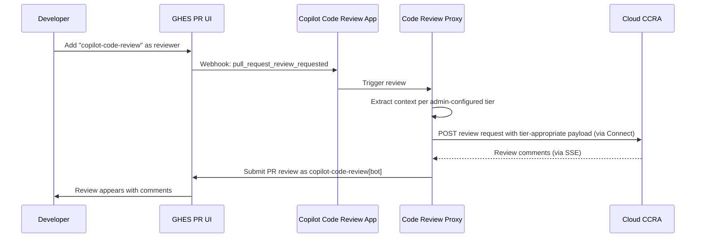
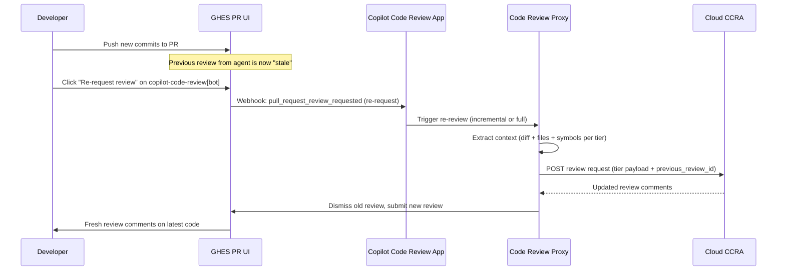
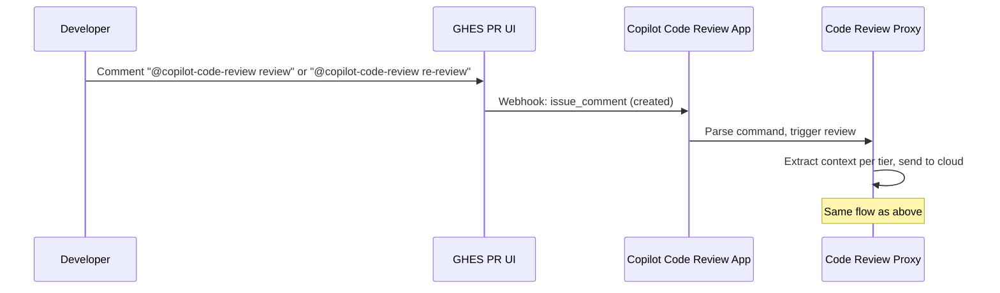

Design: Code Review Agent Identity & Interaction Model on GHES
---
# Design: Code Review Agent Identity & Interaction Model on GHES

## Problem

For cloud-connected code review to feel native on GHES, users need to:
1. **Assign** the code review agent as a PR reviewer (just like assigning a human)
2. **Request re-reviews** after pushing changes (standard GitHub reviewer UX)
3. **See reviews posted by a named identity** (not anonymous system comments)

This requires the agent to have a **local identity** on the GHES instance that participates in the reviewer assignment and review submission workflows.

---

## Identity Options

### Option A: GitHub App on GHES (Recommended)

A dedicated GitHub App installed on the GHES instance, registered as part of the Connect enablement flow.

```
┌─────────────────────────────────────────────────┐
│  GHES Instance                                  │
│                                                 │
│  GitHub App: "Copilot Code Review"              │
│  ├─ App slug: copilot-code-review               │
│  ├─ Bot user: copilot-code-review[bot]          │
│  ├─ Permissions:                                │
│  │   • pull_requests: write (post reviews)      │
│  │   • contents: read (read diffs)              │
│  │   • metadata: read                           │
│  │   • checks: write (status checks)            │
│  ├─ Events subscribed:                          │
│  │   • pull_request                             │
│  │   • pull_request_review                      │
│  │   • issue_comment (for @mentions)            │
│  └─ Installed on: all repos (org-level)         │
│                                                 │
└─────────────────────────────────────────────────┘
```

**Pros:**
- Native reviewer identity (`copilot-code-review[bot]` appears in reviewer list)
- Can be assigned as reviewer via UI suggested reviewers
- Posts reviews under its own avatar and name
- Well-understood permission model (scoped to installed repos)
- Supports webhook events for triggers (PR created, review requested)
- Works with existing GHES App infrastructure

**Cons:**
- App must be pre-registered on GHES (shipped with GHES release or auto-created on Connect enablement)
- Slightly more complex provisioning vs a simple bot user

### Option B: Machine User (Bot Account)

A reserved bot account (like `ghost` or `dependabot`) created on the GHES instance.

**Pros:** Simple identity model
**Cons:** No app permission scoping, consumes a license seat, less standard for automation

### Option C: Integration via Copilot Identity

Reuse the existing Copilot identity (if one exists on GHES for completions).

**Pros:** Unified Copilot brand
**Cons:** Copilot doesn't currently have a first-class user/app identity on GHES that participates in PR workflows

**Recommendation: Option A** — GitHub App is the standard pattern for automation on GitHub. Dependabot already works this way on GHES.

---

## Interaction Flows

### Flow 1: Assign Agent as Reviewer



**UX Details:**
- `copilot-code-review[bot]` appears in the "Suggested reviewers" list (configurable per repo/org)
- Assignment triggers the review immediately
- Review status shows as pending until results arrive

### Flow 2: Re-Review After Push



**UX Details:**
- When the developer pushes, the agent's previous review shows as "stale" (standard GitHub behavior)
- Developer clicks ♻️ "Re-request review" button next to the agent's name
- New review can be **incremental** (only review new changes) or **full** (re-review everything)
- Previous review is dismissed and replaced

### Flow 3: @mention Trigger



**Commands supported:**
- `@copilot-code-review review` — trigger full review
- `@copilot-code-review re-review` — review only new changes since last review
- `@copilot-code-review focus <path>` — review specific files only

### Flow 4: Auto-Review on PR Create (Optional)

```
Admin config: copilot_code_review.auto_review_on_pr_create = true

PR created → Webhook: pull_request.opened → Auto-assign agent → Trigger review
```

This removes the need for manual assignment. Configurable at org or repo level.

---

## Context Extraction by Tier

The Code Review Proxy extracts different levels of context depending on the admin-configured context tier (see [Design: Architecture & Data Flow](#18507) for full details):

| Tier | What the Proxy Extracts Locally | Review Quality |
|------|--------------------------------|----------------|
| **0: Diff-Only** | `git diff` hunks + 3 context lines | ⭐⭐ Basic |
| **1: Diff + Files** (default) | + full content of changed files (HEAD + BASE) | ⭐⭐⭐⭐ High |
| **2: Full Context** | + Blackbird symbol data + PR title/description + prior review comments | ⭐⭐⭐⭐⭐ Dotcom parity |
| **3: Agentic** | + cloud can request additional files on demand (imports, tests, configs) | ⭐⭐⭐⭐⭐+ Best |

All tiers apply admin-configured privacy controls (repo exclusions, file pattern filters, secret redaction) before any data leaves GHES. The `contents:read` permission on the App is used **only for local context extraction on GHES** — file content is read from the local git repo and packaged into the outbound payload; the permission is never delegated to the cloud.

---

## App Provisioning on GHES

### When is the App Created?

**Option: Auto-provision on GitHub Connect feature enablement**

When an admin enables the `copilot_code_review` Connect feature:

1. GHES creates the "Copilot Code Review" GitHub App internally (similar to how Dependabot app is provisioned)
2. App is auto-installed on all orgs/repos (or admin selects scope)
3. App's webhook endpoint points to the on-instance Code Review Proxy service
4. Bot user `copilot-code-review[bot]` becomes available in reviewer lists

```ruby
# Pseudocode for GHES provisioning (in github/github monolith)
class CopilotCodeReview::AppProvisioner
  def self.provision!
    app = GitHubApp.create!(
      name: "Copilot Code Review",
      slug: "copilot-code-review",
      owner: GitHub.enterprise_owner,  # Enterprise-level app
      permissions: {
        pull_requests: :write,
        contents: :read,
        checks: :write,
        metadata: :read
      },
      events: %w[pull_request pull_request_review issue_comment],
      webhook_url: "http://localhost:#{PROXY_PORT}/webhooks",
      internal: true  # Not visible in Marketplace
    )
    
    # Auto-install on all orgs
    GitHub.enterprise_organizations.each do |org|
      app.install!(org, repositories: :all)
    end
  end
end
```

### Branding & Avatar

- **Name**: "Copilot Code Review" 
- **Avatar**: Copilot logo (shipped with GHES release assets)
- **Badge**: Shows "[bot]" suffix like other apps
- **Profile**: Links to admin settings page for configuration

---

## Review Presentation

### How Reviews Appear in the PR UI

```
┌─────────────────────────────────────────────────────────┐
│  copilot-code-review[bot] reviewed 2 minutes ago        │
│  ┌─ Changes requested ──────────────────────────────┐   │
│  │                                                   │   │
│  │  💬 3 comments                                    │   │
│  │                                                   │   │
│  │  src/auth.go:42                                   │   │
│  │  ⚠️ Potential SQL injection vulnerability.        │   │
│  │  The user input is interpolated directly into     │   │
│  │  the query string without parameterization.       │   │
│  │                                                   │   │
│  │  💡 Suggested fix:                                │   │
│  │  ```suggestion                                    │   │
│  │  db.Query("SELECT * FROM users WHERE id = ?", id)│   │
│  │  ```                                              │   │
│  │                                                   │   │
│  └───────────────────────────────────────────────────┘   │
│                                                           │
│  [Dismiss review]  [Re-request review ♻️]                 │
└─────────────────────────────────────────────────────────┘
```

### Review Actions

| Action | Behavior |
|--------|----------|
| **Changes requested** | Blocks merge (if branch protection requires it) |
| **Comment** | Non-blocking advisory comments |
| **Approve** | Agent can approve if no issues found (configurable) |
| **Dismiss** | Developer can dismiss agent review (standard UX) |
| **Re-request** | Triggers fresh review on current HEAD |

### Branch Protection Integration

Admins can add `copilot-code-review[bot]` as a required reviewer in branch protection rules:
- PR cannot merge until agent has reviewed
- Agent review must not have "Changes requested" status

---

## Changes to Original Design

| Original Design Aspect | Change |
|------------------------|--------|
| **Trigger mechanism** | Was: GHES event listener. Now: GitHub App webhook (`pull_request_review_requested`) |
| **Result delivery** | Was: Proxy applies comments via internal API. Now: App submits PR review as its bot identity |
| **Identity** | Was: No agent identity. Now: `copilot-code-review[bot]` GitHub App |
| **Re-review** | Was: Not considered. Now: Standard "re-request review" UX |
| **@mentions** | Was: Not considered. Now: `@copilot-code-review` triggers in comments |
| **Branch protection** | Was: Not considered. Now: Agent can be a required reviewer |
| **Auto-assign** | Was: Admin config only. Now: Also supports CODEOWNERS integration |

---

## CODEOWNERS Integration

The agent can be referenced in CODEOWNERS files:

```
# .github/CODEOWNERS
# Copilot reviews all Go files
*.go    @copilot-code-review

# Copilot reviews security-sensitive paths
internal/auth/    @security-team @copilot-code-review
```

This enables automatic assignment without admin-level auto-review config.

---

## Open Questions

1. **Can the agent approve PRs?** Some teams may want the agent to approve if no issues found. Others may want it comment-only. Should be configurable.
2. **Review severity**: Should "Changes requested" be default, or should the agent always use "Comment" (non-blocking)?
3. **Incremental re-review**: On re-request, should the agent review only new commits or the full diff? (Configurable per repo?)
4. **Rate limiting per bot**: If the app is auto-assigned on all PRs, what's the rate limit per GHES instance?
5. **App pre-existence**: Should the app ship with GHES (like Dependabot) or be created dynamically on Connect enablement?
6. **CODEOWNERS support**: Any GHES-specific limitations on bot users in CODEOWNERS?


