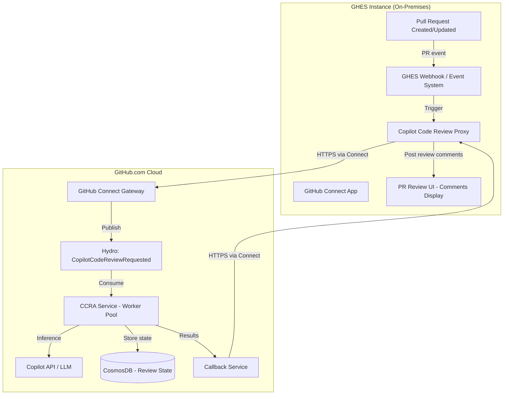
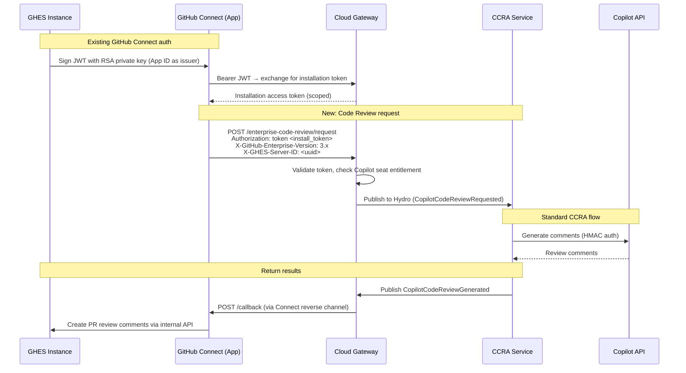
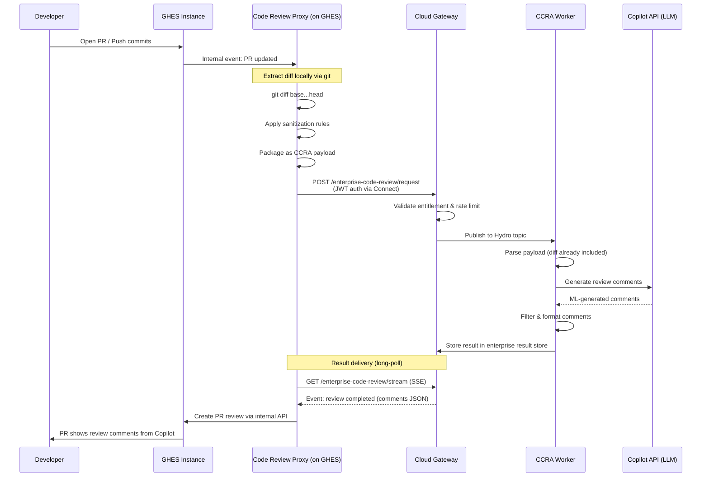

Design: cloud-connected copilot code review for GHES
---
# Design: Cloud-Connected Code Review Agent for GHES Repos

## Context & Problem Statement

**Copilot Code Review Agent (CCRA)** runs as a cloud service on GitHub.com. It reviews PRs by:
1. Consuming events from Hydro (Kafka) when a PR review is requested
2. Fetching diffs from GitHub API
3. Running ML-based detection via CAPI (Copilot API)
4. Returning comments via callbacks or Hydro events

**GitHub Enterprise Server (GHES)** runs on-premises. Currently:
- GHES explicitly **blocks all Copilot routes** (`unless GitHub.enterprise?`)
- Copilot completions work on GHES only because editors bypass GHES and call `api.githubcopilot.com` directly
- **Code review is entirely absent** — there's no PR event dispatch, no review UI, no results ingestion path on GHES

**GitHub Connect** provides GHES→GitHub.com HTTPS connectivity via a GitHub App JWT auth model, but does **not** currently support Copilot features.

**Goal**: Design a system where GHES repos can get cloud-powered code reviews without exposing source code beyond what's necessary for the review.

---

## Architecture Overview



---

## Key Design Decisions

### 1. Data Residency & Context Model

#### What Dotcom CCRA Actually Sends to CAPI

On GitHub.com today, CCRA sends significantly more than just diffs:

| Context Type | Data | Purpose |
|-------------|------|---------|
| **Diff hunks** | Unified diff with ~3 context lines per hunk | Core change detection |
| **Full file content (HEAD)** | Complete source of changed files at PR head | Symbol resolution, cross-reference, autofix |
| **Full file content (BASE)** | Complete source of changed files at base branch | Before/after comparison, refactoring detection |
| **PR metadata** | Title, description, head SHA | Intent understanding |
| **Symbol information** | Function/class definitions via Blackbird parser | Semantic understanding of code structure |
| **Snippy integration** | Code clone/copyright detection | License compliance checks |
| **MCP tools** | Runtime tool access to repo (search, analysis) | Deep context retrieval for agentic reviews |
| **Prior review comments** | Resolution status of previous review comments | Avoid duplicate findings on re-review |
| **User/org metadata** | User ID, org list, access type, integration ID | Entitlement, routing, personalization |

#### Context Tiers for GHES (Admin-Configurable)

Since different enterprises have different privacy requirements, GHES offers configurable context tiers that trade off review quality vs. data exposure:

| Tier | Data Sent to Cloud | Review Quality | Privacy Level |
|------|-------------------|----------------|---------------|
| **Tier 0: Diff-Only** | Diff hunks (with 3 context lines) + file paths | ⭐⭐ Basic | 🔒🔒🔒 Maximum privacy |
| **Tier 1: Diff + Files** | Diff hunks + full content of changed files (HEAD + BASE) | ⭐⭐⭐⭐ High (matches dotcom non-agentic) | 🔒🔒 High privacy |
| **Tier 2: Full Context** | Tier 1 + symbol data + PR title/description + prior comments | ⭐⭐⭐⭐⭐ Dotcom parity | 🔒 Standard |
| **Tier 3: Agentic** | Tier 2 + MCP tool access (cloud can request additional files) | ⭐⭐⭐⭐⭐+ Best possible | ⚠️ Cloud may retrieve additional repo content on demand |

```yaml
# GHES Admin Configuration
copilot_code_review:
  context_tier: 1                         # Default: Diff + Files (recommended)
  # Tier 0: diff_only
  # Tier 1: diff_and_files (default, recommended)
  # Tier 2: full_context
  # Tier 3: agentic (requires separate consent)
```

#### What Each Tier Sends

**Tier 0 — Diff-Only** (maximum privacy, degraded quality):
```json
{
  "pull_request": {
    "diffs": [{"file_path": "src/auth.go", "diff": "@@ -12,7 +12,9 @@ ...", "start_line": 12}],
    "head_revision": "abc123",
    "repository": {"id": "hashed-id"}
  }
}
```
- ⚠️ No full file content → model cannot see surrounding code → higher false positive rate
- ⚠️ No symbol info → cannot understand function signatures or class hierarchies
- ✅ Minimal data exposure — only changed lines + immediate context

**Tier 1 — Diff + Files** (recommended default):
```json
{
  "pull_request": {
    "diffs": [...],
    "head_file_contents": [{"path": "src/auth.go", "content": "package auth\n..."}],
    "base_file_contents": [{"path": "src/auth.go", "content": "package auth\n..."}],
    "head_revision": "abc123",
    "repository": {"id": "hashed-id"}
  }
}
```
- ✅ Full content of **only changed files** — model can understand complete context
- ✅ Base content enables before/after comparison
- ✅ Matches dotcom non-agentic review quality
- ⚠️ Entire changed files leave GHES (not just diff lines)

**Tier 2 — Full Context** (dotcom parity):
```json
{
  "pull_request": {
    "diffs": [...],
    "head_file_contents": [...],
    "base_file_contents": [...],
    "title": "Add OAuth2 support",
    "description": "Implements RFC 6749...",
    "head_revision": "abc123",
    "comments": {"file:line": "resolved"},
    "repository": {"id": "real-id", "name": "my-app", "owner": "my-org"}
  },
  "symbols": [{"name": "authenticate", "type": "function", "line": 42}],
  "snippy_enabled": true
}
```
- ✅ Symbol information enables semantic analysis
- ✅ PR title/description provide intent context
- ✅ Prior comments enable intelligent re-review (avoid duplicates)
- ⚠️ Repo name/owner are sent in cleartext
- ⚠️ PR description may contain sensitive planning information

**Tier 3 — Agentic** (best quality, most data exposure):
- Everything from Tier 2
- Cloud CCRA can request additional files via MCP tools (e.g., imports, test files, config)
- Requires a **reverse data channel**: cloud sends file-fetch requests back to GHES proxy
- ⚠️ Cloud may access files beyond the immediate diff
- ⚠️ Requires explicit admin consent and per-request audit logging

```
Cloud CCRA → "Need content of src/auth_test.go for context"
         → Request sent back via Connect channel
GHES Proxy → Validates request against allowlist
           → Returns file content (or denies)
```

#### Privacy Controls (All Tiers)

| Control | Description |
|---------|-------------|
| `excluded_repos` | Repos that never send data to cloud |
| `excluded_file_patterns` | File patterns stripped from payload (e.g., `*.env`, `*.key`) |
| `max_file_size_bytes` | Skip files larger than threshold |
| `redact_string_literals` | Replace string literals with `<REDACTED>` |
| `redact_secrets` | Run secret scanning on payload before transmission |
| `audit_log_payloads` | Log metadata of every payload sent (file list, sizes, tier) |
| `require_user_consent` | Users must opt-in per review (not just admin-level) |

#### Data That NEVER Leaves GHES (Regardless of Tier)

| Data | Rationale |
|------|-----------|
| Git history (commits, blame) | Not needed for diff review |
| Issues, wikis, discussions | Not code context |
| CI/CD secrets, env variables | Infrastructure credentials |
| Other repos' content (Tier 0-2) | Only changed files in the PR |
| User passwords, tokens, SSH keys | Authentication material |

### 2. Authentication & Authorization



**Key Auth Points:**
- **GHES → Cloud**: Reuses GitHub Connect's JWT + installation token model (no new auth system needed)
- **Entitlement check**: Cloud gateway validates that the GHES enterprise has Copilot Enterprise seats
- **CCRA → CAPI**: Unchanged (HMAC auth with `COPILOT_API_HMAC_KEY`)
- **Results → GHES**: Cloud pushes via Connect's reverse channel (new capability needed)

### 3. Event Transport: Extending GitHub Connect

Currently GitHub Connect is **pull-only** (GHES initiates all connections). For code review we need:

#### Option A: Polling Model (Simpler, works today)
```
GHES Proxy polls: GET /enterprise-code-review/results?server_id=<uuid>&since=<timestamp>
Cloud responds with completed reviews
GHES applies comments locally
```
- **Pro**: No new infra; works within existing Connect constraints
- **Con**: Latency (polling interval), wasted requests when idle

#### Option B: Long-Poll / Server-Sent Events
```
GHES opens: GET /enterprise-code-review/stream?server_id=<uuid>
Cloud holds connection open, pushes results as they complete
Connection auto-reconnects on timeout
```
- **Pro**: Near-real-time delivery, efficient
- **Con**: Requires persistent outbound connection from GHES

#### Option C: Webhook Push (Requires GHES to accept inbound)
```
Cloud calls: POST https://<ghes-host>/api/v3/copilot/code-review/callback
GHES exposes endpoint behind firewall/VPN
```
- **Pro**: Immediate delivery, familiar pattern
- **Con**: Requires inbound connectivity (breaks GHES security model for many customers)

**Recommendation**: **Option B (Long-Poll/SSE)** — GHES already maintains outbound HTTPS connections for Connect. A long-lived connection is natural and provides near-real-time results without requiring inbound connectivity.

### 4. GHES-Side Components (New)

#### 4a. Copilot Code Review Proxy Service

A new lightweight service running on the GHES appliance:

```
┌───────────────────────────────────────────────────────────┐
│  GHES: Copilot Code Review Proxy                          │
├───────────────────────────────────────────────────────────┤
│                                                           │
│  ┌──────────────┐    ┌──────────────────┐                 │
│  │ Event        │    │ Result           │                 │
│  │ Listener     │    │ Applier          │                 │
│  │              │    │                  │                 │
│  │ • PR events  │    │ • Poll/SSE       │                 │
│  │ • Review     │    │ • Map comments   │                 │
│  │   requests   │    │ • Create review  │                 │
│  └──────┬───────┘    └────────┬─────────┘                 │
│         │                     │                           │
│  ┌──────▼─────────────────────▼─────────┐                 │
│  │ Connect Client (existing)            │                 │
│  │ • JWT auth                           │                 │
│  │ • Installation token                 │                 │
│  │ • HTTPS outbound                     │                 │
│  └──────────────────────────────────────┘                 │
│                                                           │
│  ┌──────────────────────────────────────┐                 │
│  │ Context Extractor (tier-aware)       │                 │
│  │ • Tier 0: git diff only             │                 │
│  │ • Tier 1: + git show HEAD/BASE:<path>│                 │
│  │ • Tier 2: + Blackbird symbols + PR   │                 │
│  │           metadata + prior comments  │                 │
│  │ • Apply sanitization/redaction rules │                 │
│  │ • Package as CCRA-compatible payload │                 │
│  └──────────────────────────────────────┘                 │
│                                                           │
│  ┌──────────────────────────────────────┐                 │
│  │ MCP File Server (Tier 3 only)        │                 │
│  │ • Receives file-fetch requests from  │                 │
│  │   cloud via Connect long-poll        │                 │
│  │ • Validates against admin allowlist  │                 │
│  │ • Returns file content or denies     │                 │
│  │ • Audit logs every file access       │                 │
│  └──────────────────────────────────────┘                 │
│                                                           │
└───────────────────────────────────────────────────────────┘
```

**Responsibilities:**
1. Listen for PR events (create, update, review-requested) via App webhook
2. Extract context locally based on admin-configured tier:
   - Tier 0: `git diff base...head` (hunks + 3 context lines)
   - Tier 1: + `git show HEAD:<path>` and `git show BASE:<path>` for changed files
   - Tier 2: + symbol parsing via Blackbird + PR title/description + prior comments
   - Tier 3: + serve on-demand file requests from cloud (validated against allowlist)
3. Apply sanitization/exclusion rules (secret redaction, pattern filtering)
4. Package payload in CCRA `request.Payload` format
5. Transmit via GitHub Connect to cloud
6. Receive results and submit PR review as `copilot-code-review[bot]`

#### 4b. Admin Configuration (Site Admin UI)

```yaml
# Example GHES Management Console settings
copilot_code_review:
  enabled: true
  
  # Context tier (determines what data leaves GHES)
  context_tier: 1                         # 0=diff-only, 1=diff+files, 2=full, 3=agentic
  
  # Privacy controls
  max_payload_size_bytes: 5242880         # 5MB max total payload sent to cloud
  max_file_size_bytes: 524288             # 512KB max per file (skip larger files)
  excluded_repos: ["internal/secrets-*"]
  excluded_file_patterns: ["*.env", "*.key", "*.pem", "*.p12"]
  redact_secrets: true                    # Run secret scanning before transmission
  redact_string_literals: false           # Replace string literals with placeholders
  audit_log_payloads: true                # Log file list + sizes for every review sent
  
  # Tier 3 specific (agentic MCP file access)
  agentic_file_allowlist: ["*.go", "*.ts", "*.py", "*.java"]  # Only serve these to cloud
  agentic_max_files_per_review: 20        # Max additional files cloud can request
  agentic_require_user_consent: true      # Prompt user before serving extra files
  
  # Behavior
  auto_review_on_pr_create: true
  auto_review_on_push: false
  require_explicit_request: false         # @copilot review trigger only
  
  # Rate limiting (per enterprise seat allocation)  
  max_reviews_per_hour: 100
  max_reviews_per_repo_per_hour: 20
```

### 5. Cloud-Side Components (New/Modified)

#### 5a. Enterprise Code Review Gateway

New HTTP service (or route group on existing CCRA) that:
- Accepts requests from GitHub Connect (validates installation tokens)
- Validates Copilot Enterprise entitlement for the GHES enterprise
- Translates GHES payloads into standard CCRA `request.Payload`
- Publishes to existing Hydro topic (`CopilotCodeReviewRequested`)
- Stores pending results keyed by `(server_id, review_request_id)`
- Serves results via long-poll/SSE endpoint

```go
// New routes on CCRA or dedicated gateway service
router.Post("/enterprise-code-review/request", handleEnterpriseReviewRequest)
router.Get("/enterprise-code-review/stream/{server_id}", handleEnterpriseResultStream)
router.Get("/enterprise-code-review/results/{server_id}", handleEnterpriseResultPoll)
```

#### 5b. Modified CCRA Execution (Minimal Changes)

The core CCRA pipeline needs **minimal modification**:

| Step | Change Needed |
|------|--------------|
| Payload parsing | Add `Source: "ghes"` field to `request.Payload` |
| Diff retrieval | **Skip** — diff already provided in payload (no GitHub API call needed) |
| Snippy check | May skip for GHES (or run if connected) |
| CAPI inference | **Unchanged** |
| Comment filtering | **Unchanged** |
| Fix generation | **Unchanged** |
| Result publishing | Route to enterprise result store instead of/in addition to Hydro |
| Feature flags | New GHES-specific flags (per enterprise, per server) |

**Key insight**: Since GHES provides the diff in the request payload (extracted locally), CCRA doesn't need GitHub API access to the GHES instance. This is a significant simplification.

#### 5c. Result Store

```go
// New CosmosDB container or partition for GHES results
type EnterpriseReviewResult struct {
    ServerID        string    // GHES instance UUID
    ReviewRequestID string    // Correlates request → result
    EnterpriseID    string    // GitHub.com enterprise account
    Status          string    // "pending", "completed", "failed"
    Comments        []Comment // Review comments
    CreatedAt       time.Time
    ExpiresAt       time.Time // TTL: 24h (results must be consumed)
}
```

### 6. New GitHub Connect Feature Registration

Add `copilot_code_review` to the Connect feature list:

```ruby
# In github/github:packages/enterprise/app/models/dotcom_connection.rb
FEATURES = %w[
  license_usage_sync
  content_analysis
  dependabot_access
  actions_download_archive
  usage_metrics
  search
  private_search
  contributions
  copilot_code_review    # NEW
].freeze
```

This enables:
- Per-instance opt-in via GHES admin UI
- Permission scoping on GitHub.com side
- Feature-specific telemetry and billing

---

## Sequence Diagram: Full End-to-End Flow



---

## Security Considerations

| Concern | Mitigation |
|---------|-----------|
| Source code exposure | Only diff hunks transit; admin can exclude repos/patterns |
| Man-in-the-middle | TLS 1.3 on all Connect traffic; certificate pinning optional |
| Token theft | JWT tokens are short-lived (10min); installation tokens scoped to Connect app |
| Replay attacks | Request nonces (already used in CCRA callback validation) |
| DDoS on cloud | Per-enterprise rate limiting; GHES server_id validation |
| Results tampering | HMAC signature on result payloads; GHES verifies before applying |
| Air-gapped environments | Feature simply unavailable (requires outbound HTTPS) |
| Leaked secrets in diffs | On-prem sanitization layer strips known patterns pre-transmission |

---

## Rollout Strategy

### Phase 1: Private Beta (Feature-flagged)
- Manual enablement per GHES enterprise
- Polling-based result delivery (Option A)
- Basic diff-only reviews (no agentic autofind)
- Admin audit log of all diffs transmitted

### Phase 2: GA with SSE
- Self-service enablement via GitHub Connect UI
- Long-poll/SSE for real-time results
- Autofix suggestions included
- Repository-level opt-in/opt-out

### Phase 3: Enhanced Features
- Agentic autofind support (requires GitHub Actions connectivity)
- Custom review rules per enterprise
- On-prem model option for air-gapped (future, separate design)

---

## Open Questions

1. **Billing model**: Per-seat (Copilot Enterprise)? Per-review? Bundled with existing Copilot Enterprise?
2. **GHES version minimum**: Which GHES version introduces this? (GitHub Connect API version compatibility)
3. **Diff size limits**: What's the max diff size we'll accept from GHES? (Current CCRA has limits; should GHES enforce locally too?)
4. **Agentic path**: Can agentic autofind work for GHES if the code isn't accessible from GitHub Actions runners?
5. **Existing Copilot GHES auth**: Should code review piggyback on the existing `/copilot_internal/v2/token` flow, or use Connect exclusively?
6. **Result TTL**: How long should results be stored in cloud before expiring? (24h proposed)
7. **Multi-GHES**: Can multiple GHES instances share an enterprise's Copilot seat pool?

---

## Summary

The design leverages the **existing GitHub Connect infrastructure** (JWT auth, outbound HTTPS from GHES) to add code review as a new Connect feature. The key architectural insight is that **GHES extracts diffs locally** and sends only diff hunks to the cloud, eliminating the need for CCRA to have GitHub API access to the GHES instance. This preserves the GHES security model (no inbound connections) while enabling full ML-powered code review.

Changes required:
- **GHES**: New proxy service (~2K LOC), new Connect feature registration, admin UI
- **Cloud**: New gateway routes (~1K LOC), result store, minor CCRA payload changes
- **CCRA core**: Minimal — skip diff-fetch step when `Source == "ghes"`, route results to enterprise store
