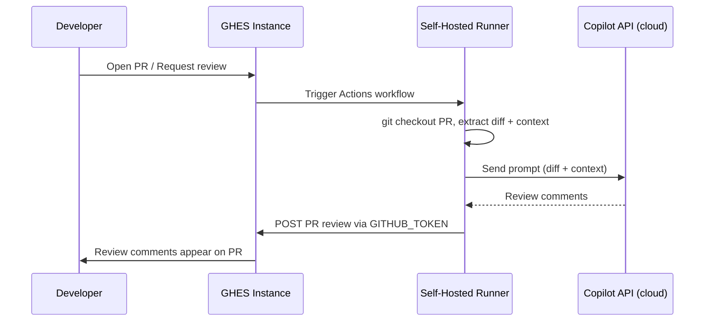

Alternative Design: Runner-Based Code Review (GHES → Self-Hosted Runner → CAPI)
---
# Alternative Design: Runner-Based Code Review via Self-Hosted Runners

Parent initiative: #18506
Contrast with: #18507 (Connect-based architecture)

## Overview

Instead of building a custom GHES proxy + GitHub Connect gateway, code review runs as a **GitHub Actions workflow on a customer self-hosted runner** that calls CAPI directly.



## Key Insight: IDE Mode Already Works Without Cloud Infra

Investigation of the CCRA codebase reveals that **IDE execution mode** already operates without:
- ❌ Hydro/Kafka (no event publishing)
- ❌ CosmosDB (no state persistence)
- ❌ sweagentd (no agentic dispatch)

IDE mode only needs: **CAPI client + autofind detector library + GitHub API client**

This is exactly the dependency set a runner-based CLI would have.

---

## Architecture

```
┌────────────────────────────────────────────────────────────────┐
│  Customer Infrastructure                                       │
│                                                                │
│  ┌──────────────┐         ┌─────────────────────────────────┐  │
│  │ GHES Instance│         │ Self-Hosted Runner              │  │
│  │              │ ───────▶│                                 │  │
│  │ • PR event   │ Actions │ • Checks out PR code            │  │
│  │ • Triggers   │ dispatch│ • Runs copilot-code-review CLI  │  │
│  │   workflow   │         │ • Extracts diff + file context  │  │
│  │              │         │ • Calls CAPI for inference      │  │
│  │              │◀─────── │ • Posts review via GITHUB_TOKEN │  │
│  │ • Displays   │ API call│                                 │  │
│  │   review     │         └─────────────────────────────────┘  │
│  └──────────────┘                      │                       │
│                                        │ HTTPS (outbound only) │
└────────────────────────────────────────┼───────────────────────┘
                                         │
                                         ▼
                              ┌──────────────────────┐
                              │  Copilot API (CAPI)  │
                              │  (GitHub cloud)      │
                              │                      │
                              │  • LLM inference     │
                              │  • Model routing     │
                              └──────────────────────┘
```

---

## Workflow Definition

```yaml
# .github/workflows/copilot-code-review.yml (shipped as reusable workflow)
name: Copilot Code Review
on:
  pull_request:
    types: [opened, synchronize, review_requested]

permissions:
  pull-requests: write
  contents: read

jobs:
  review:
    runs-on: self-hosted  # Customer's runner
    steps:
      - uses: actions/checkout@v4
        with:
          fetch-depth: 0  # Full history for diff

      - name: Run Copilot Code Review
        uses: github/copilot-code-review-action@v1
        with:
          copilot_token: ${{ secrets.COPILOT_TOKEN }}  # PAT with Copilot seat
          context_tier: 1                               # diff + files
          review_action: comment                        # comment_only | changes_requested
        env:
          GITHUB_TOKEN: ${{ secrets.GITHUB_TOKEN }}     # For posting reviews
```

---

## Authentication Model

### CAPI Access (Copilot API)

The runner needs a token to call CAPI. Two options:

**Option A: Stored PAT with Copilot seat (simplest)**
- Admin creates a service account with Copilot seat on the linked GitHub.com enterprise
- Stores PAT as org/repo secret (`COPILOT_TOKEN`)
- Action exchanges PAT for Copilot session token via `/copilot_internal/v2/token`
- Session token used for CAPI calls (~30 min expiry, auto-refreshed)

**Option B: GitHub App installation + Copilot entitlement (better)**
- Copilot Code Review App installed on GHES (same as #18509 identity design)
- App's installation token exchanged for Copilot session token
- ⚠️ Requires: GHES `/copilot_internal/v2/token` endpoint to accept App installation tokens (unverified — may need platform work)

**Option C: HMAC service credential (internal only)**
- A CAPI HMAC key provisioned specifically for GHES runner use
- Stored as encrypted org secret
- ⚠️ Risk: runner compromise exposes CAPI credentials
- ⚠️ Requires: CAPI team to provision and scope credentials per-enterprise

**Recommendation**: Option A for initial launch (simplest), migrate to Option B once platform supports it.

### Posting Reviews Back to GHES

- `GITHUB_TOKEN` with `pull-requests: write` — works out of the box
- Posts via `POST https://<ghes>/api/v3/repos/{owner}/{repo}/pulls/{pr}/reviews`
- No additional auth needed

---

## The CLI Tool: `copilot-code-review-action`

A new GitHub Action (or standalone CLI binary) that:

1. **Extracts context** (tier-aware, same as #18507):
   - Tier 0: `git diff $BASE...$HEAD`
   - Tier 1: + read full changed files
   - Tier 2: + symbol parsing + PR metadata
   
2. **Calls CAPI** for comment generation:
   - Uses the autofind detector library (same `codeml-detector` as CCRA)
   - Constructs prompts identical to IDE mode
   - Sends to CAPI via Copilot session token

3. **Posts review** via GitHub API:
   - Maps comments to PR diff positions
   - Creates PR review with inline comments
   - Supports "Comment" or "Changes Requested" actions

4. **Handles failures gracefully**:
   - CAPI timeout → post summary comment "Review timed out, re-run workflow"
   - Auth failure → post comment with instructions
   - Partial results → post what succeeded, note what failed

### Binary Distribution

- Pre-built binary included in the Action container (Linux amd64/arm64)
- Or: customer downloads from GHES release assets
- Versioned alongside GHES releases for compatibility

---

## Comparison: Connect-Based vs Runner-Based

| Aspect | Connect-Based (#18507) | Runner-Based (this) |
|--------|----------------------|---------------------|
| **Code leaves customer infra?** | Yes (to cloud gateway) | **No** (stays on runner; only prompts go to CAPI) |
| **New GHES infrastructure** | Proxy service, Connect feature, seat sync | **None** (Actions already exists) |
| **New cloud infrastructure** | Gateway, result store, enterprise queue | **None** (CAPI already exists) |
| **Customer prerequisites** | GitHub Connect enabled | Self-hosted runner + Actions enabled + outbound to CAPI |
| **Privacy model** | Admin-configured tiers | **Inherent** — code never leaves customer network |
| **Latency** | Higher (GHES → cloud → CCRA → result → GHES) | **Lower** (runner calls CAPI directly) |
| **Complexity** | High (new services on both sides) | **Low** (Action + CLI binary) |
| **Reviewer identity** | `copilot-code-review[bot]` (native) | `github-actions[bot]` or dedicated App |
| **Re-review UX** | Native re-request button | Re-run workflow (or workflow_dispatch) |
| **Offline/air-gapped** | Unavailable | Unavailable (needs CAPI) |
| **Agentic (Tier 3)** | Complex (reverse channel) | **Trivial** (runner has full repo access) |
| **Scalability** | Cloud-managed worker pool | Customer-managed runner capacity |
| **Admin controls** | GHES Management Console | Workflow YAML + org/repo secrets |
| **Billing/metering** | Cloud tracks via entitlement | CAPI tracks via session token |

---

## Advantages of Runner-Based Approach

1. **Privacy by architecture** — Source code stays in customer infra. Only LLM prompts (constructed from code) transit to CAPI. This is the same trust boundary as Copilot completions in editors.

2. **No new infrastructure** — Uses existing Actions + runners + CAPI. No Connect changes, no proxy service, no cloud gateway, no result store.

3. **Faster to build** — The Action is essentially a packaged version of CCRA's IDE mode with a GitHub API review-posting layer. Estimated 6-8 weeks for 2 engineers.

4. **Agentic is trivial** — The runner has full repo access. "Tier 3" (reading additional files for context) is just `cat` on the runner. No reverse channel needed.

5. **Customer controls runner environment** — They choose hardware, network policies, and can air-gap except for CAPI outbound.

---

## Disadvantages / Limitations

1. **Reviewer identity**: Reviews posted as `github-actions[bot]` (unless a dedicated App token is used). Less native than a purpose-built bot.

2. **Re-review UX**: If posting as `github-actions[bot]`, no "Re-request review" button. Solved by using the hybrid approach (App identity posts the review → standard re-request UX works).

3. **Customer must manage runners**: Requires Actions enabled + self-hosted runner capacity. Some GHES customers don't use Actions.

4. **Auth complexity**: Requires a stored PAT/secret with Copilot seat. Secret rotation, seat management fall on the customer.

5. **No native suggested reviewers**: Can't appear in the reviewer dropdown. Must use auto-trigger via `pull_request` event or manual workflow dispatch.

6. **Fork PRs**: `GITHUB_TOKEN` is read-only for fork PRs. Cannot post reviews without a PAT secret (which isn't available to fork PR workflows by default).

7. **CAPI outbound access**: Runners must be able to reach CAPI endpoint. Some strict network environments may block this.

---

## Hybrid Approach: Runner + Bot Identity

Combine the runner execution model with the App identity from #18509:

```yaml
jobs:
  review:
    runs-on: self-hosted
    steps:
      - uses: actions/checkout@v4
      - name: Run Code Review
        uses: github/copilot-code-review-action@v1
        with:
          copilot_token: ${{ secrets.COPILOT_TOKEN }}
          # Post as the Copilot Code Review App instead of github-actions[bot]
          app_id: ${{ secrets.CODE_REVIEW_APP_ID }}
          app_private_key: ${{ secrets.CODE_REVIEW_APP_KEY }}
```

This gives:
- ✅ Runner execution (privacy, simplicity)
- ✅ Native bot identity (`copilot-code-review[bot]`)
- ✅ Can be assigned as reviewer (App submits review)
- ⚠️ Requires storing App private key as secret

---

## Implementation Estimate (2 Engineers)

| Work | Effort |
|------|--------|
| CLI binary (extract context, call CAPI, format review) | 4-5 weeks |
| GitHub Action wrapper (inputs, auth, error handling) | 2 weeks |
| CAPI auth integration (token exchange, refresh) | 2 weeks |
| Review posting layer (map comments to PR positions) | 2 weeks |
| Testing on GHES with self-hosted runner | 2 weeks |
| Docs, admin guide, troubleshooting | 1 week |
| **Total** | **~8-10 weeks (2-2.5 months)** |

Compare to Connect-based: 5-6 months to beta. **Runner-based is 2-3x faster to ship.**

---

## Open Questions

1. **Can GHES `/copilot_internal/v2/token` accept App installation tokens?** If yes, this eliminates the PAT requirement.
2. **Should this be a reusable workflow or a composite action?** Reusable workflow hides complexity; composite action is more flexible.
3. **Binary size/distribution**: Can the autofind detector library be compiled into a ~50MB static binary for the runner?
4. **Rate limiting**: How does CAPI rate-limit session-token-based requests? Is per-user or per-enterprise?
5. **Can both approaches coexist?** Runner-based for Phase 1 (fast to ship), Connect-based for Phase 2 (better UX)?
6. **Workflow trigger for reviewer assignment**: Can we trigger on `pull_request_review_requested` to mimic the "assign as reviewer" UX?


